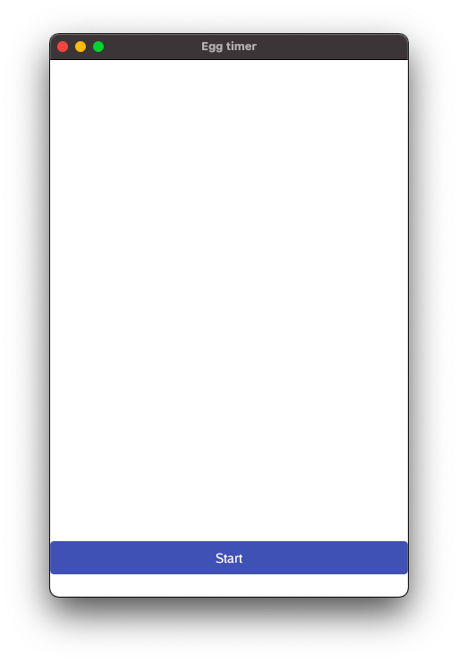

# Chapter 4 - Low button 

## Goals
The intention of this section is to move the button to the bottom. To do that we start using the [Flexbox layout concept]((https://developer.mozilla.org/en-US/docs/Web/CSS/CSS_Flexible_Box_Layout/Basic_Concepts_of_Flexbox))



## Outline
The last chapter was all about the overall structure of the program. Now we zoom into the **system.FrameEvent** and start using the [Flexbox](https://pkg.go.dev/gioui.org/layout#Flex) 

## Overall structure

### Code
You know the overall strucutre of the program like the back of your hand out from last chapter. So instead of repeating it all, so here we´re only going to focus on what´s happening inside the **system.FrameEvent**:

First look at the Layout

```go
case system.FrameEvent:

    layout.Flex{
    // ...
    }.Layout( //...
        // We insert two rigid elements:
        // First a button ...
        layout.Rigid(),
        // .. then an empty spacer
        layout.Rigid(),
    }
```

### Comments

This we can work with:
1. First we define a **Flexbox** through Layout.Flex
1. Then we place a new **Layout** onto that Flexbox
1. That 2nd layout contains two **rigids**. 
  a. First one to contain the button
  b. Then one to contain a spacer below it.

**Flex** lays out a list of children. 
- Rigid children are laid out first and Flexed children laid out after.
- Apart from that, children are positioned in the order they are defined.

**Rigid** is simply a Flex child filling out available space. 

#### Constraint and Dimensions
It´s worth mentioning how a Layout is bound together through [Constraints](https://pkg.go.dev/gioui.org/layout?utm_source=gopls#Constraints) and [Dimensions](https://pkg.go.dev/gioui.org/layout?utm_source=gopls#Dimensions). 
 - Constraints are the Minimum and Maxium size of a widget ´´´Min, Max image.point´´´
   - I.e. how large **can** it be
 - Dimensions are the Actual size of a widget, effectively ´´´Size image.Point´´´
   - I.e. how large is it **actually**

There are some nuances, like what to do if constraits can't me met, but for the most part this describes the dialoge between parent and child. From the parent, you create a Widget and pass in the context. The widget responds, with it´s own dimensions, effectively laying itself out. 

Note that layout operations are recursive. A child in a layout can itself be a layout. From generic components you can thus create quite involved user interfaces.

## Code in detail

OK, time to look at the whole **system.FrameEvent**:

### Code

```go
case system.FrameEvent:
    gtx := layout.NewContext(&ops, e)
    // Let's try out the flexbox layout concept:
    layout.Flex{
        // Vertical alignment, from top to bottom
        Axis: layout.Vertical,
        //Emtpy space is left at the start, i.e. at the top
        Spacing: layout.SpaceStart,
    }.Layout(gtx,
        // We insert two rigid elements:
        // First a button ...
        layout.Rigid(
            func(gtx layout.Context) layout.Dimensions {
                btn := material.Button(th, &startButton, "Start")
                return btn.Layout(gtx)
            },
        ),
        // ... then an empty spacer
        layout.Rigid(
            //The height of the spacer is 25 Device independent pixels
            layout.Spacer{Height: unit.Dp(25)}.Layout,
        ),
    )
    e.Frame(gtx.Ops)
```

### Comments

Inside ```Flex { }``` we define two characteristicts:
 - Vertical alignment. Stuff will be be placed or below each other.
 - Leftover space will be at the start
Sounds like Tetris if you ask me.

Now let's look at the two calls to **layout.Rigid( )**:
 - Rigid accepts a [Widget](https://pkg.go.dev/gioui.org/layout?utm_source=gopls#Widget)
- A Widget is simply something that returns it's own [Dimensions](https://pkg.go.dev/gioui.org/layout?utm_source=gopls#Dimensions)
- Note how this is done in very different ways: 
  a. In the first Rigid we pass in a ```func ( )``` that returns **Dimensions** from btn.Layout()
  a. In the second Rigid we create a ```Spacer { }``` struct, calls Layout on it, which again gives back **Dimensions** 
- From the parent perspective, it doesn't really matter. As long as the child returns **Dimensions**, it's good.

This takes care of laying the widgets out. But what are they really?
As the name implies, **material.Button** is a [Button](https://pkg.go.dev/gioui.org/widget/material?utm_source=gopls#Button) based on material design, as we detailed in the last chapter.

**Spacer{ }** simply adds space between widgets. Since we've defined the overall layout to be vertical, and excess space should come at the top, the button would fall all the way to the bottom. I wanted it a bit up, and the spaced did that job for us, wedging itself in between the bottom of the app and the lower end of the button. Handy stuff.
