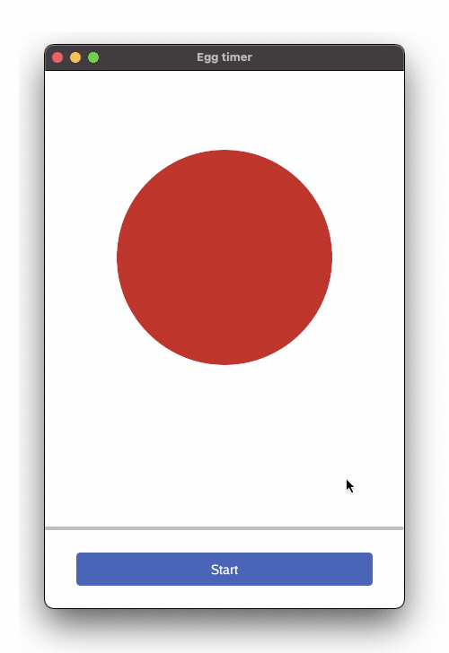

# Chapter 8 - Custom graphics - a circle

## Goals
The intention of this section is to draw custom graphics that (vaguely) resembles an egg



## Outline

The code introduces custom graphics. The circle in the app is drawn by Gio, not displaying a static picture. Tho achieve that we combine 
 - A **clip** do define the area we can draw within
 - A **paint** operation to fill that area
 - Some paramaters to set color
 
## Imports

There are some new imports, namely
 - [image](https://pkg.go.dev/image) and [image/color](https://blog.golang.org/image/color), Go's standard 2D image library.
   - Nigel Tao [writes well](https://blog.golang.org/image) about these packages on the Go blog.

 - [f32](https://pkg.go.dev/gioui.org/f32). Go's image library is based on ```int```, while Gio prefers to work with ```float32```. Hence f32 reimplements floating point versions of the two main types, ```Points``` and ```Rectangles```
 
 - [op/clip](https://pkg.go.dev/gioui.org/op/clip) is used to define an area to paint within. Drawing outside this area is ignored.

 - [op/paint](https://pkg.go.dev/gioui.org/op/paint) contains drawing operations to fill a shape with color.

## Points and Rectangles

Points and Rectangles are used extensively, so it's worth quoting from Nigel's blog mentioned above. Point's are coordinates and Rectangles are defined by Points:

```go
type Point struct {
    X, Y float32
}

type Rectangle struct {
    Min, Max Point
}
```

A Point is an X, Y coordinate pair. The axes increase right and down (origin = top left corner). It is neither a pixel nor a grid square. A Point has no intrinsic width, height or color, but the visualizations below use a small colored square.

```go
p := f32.Point{2, 1}
```

A Rectangle contains the points with Min.X <= X < Max.X, Min.Y <= Y < Max.Y. It has no intrinsic color, but the visualization below outlines it with a thin colored line, and call out their Min and Max Points.


```go
r := f32.Rect(2, 1, 5, 5)
```

For convenience, image.Rect(x0, y0, x1, y1) is equivalent to ```Rectangle{Point{x0, y0}, Point{x1, y1}}```, but is much easier to type. It also swaps Minimum and Maximum to ensure it's well formed.
   
That's it. Let's look at the code:

## Code

```go
layout.Rigid(
  func(gtx C) D {
    circle := clip.Circle{
      // Hard coding the x coordinate. Try resizing the window
      Center: f32.Point{X: 200, Y: 200},
      // Soft coding the x coordinate. Try resizing the window
      // Center: f32.Point{X: float32(gtx.Constraints.Max.X) / 2, Y: 200},
      Radius: 120,
    }.Op(gtx.Ops)
    color := color.NRGBA{R: 200, A: 255}
    paint.FillShape(gtx.Ops, color, circle)
    d := image.Point{Y: 500}
    return layout.Dimensions{Size: d}
  },
),
```

## Comments

We first define a circle using ```clip.Circle{ }```. It defines the Center point and Radius. 

The origo of the circle is hard-coded, with distance from the top left corner of the *widget*. Note that this is *not* necessarily the top left corner of the app. The size of the widget itself is coded as
```Dimensions``` using ```d := image.Point{Y: 500}```. X represents width and Y represents Height

You can play around with these dimensions, familiarizing yourself with when the circle moves up or down, depending in wheiter you resize the box or move the circle center inside the box. Also, try commenting the hard coded and uncomment the soft coding below that uses the window area as a reference. 

```color.NRGBA``` defines the color of the circle. Note that the Alpha-channel defaults to 0, i.e. invisible, so we lift it to 255 so we can actually see it.

```paint.FillShape``` fills the shape with the ```color```.

And finally we return the widget in the form of it's ```Dimensions```, height: 400.

---

[Next chapter](09_egg_as_egg.md){: .btn .fs-5 .mb-4 .mb-md-0 }
