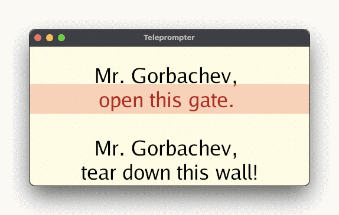

# Teleprompter - Animation and interaction

## Goals

In this project we continue from the [egg timer](../egg_timer/) and investigate more features in Gio: 
 - Programatic **animation**, using lists
 - User input, both **keyboard** and **mouse**
 - Colors and **transparency**
 - **Dynamic text**, both size and paragraph layouts




As you can see, this is a simple window with scrolling text. But looks deceive, this guy packs a serious punch. Let's (sc)roll!


## Outline

A [teleprompter](https://en.wikipedia.org/wiki/Teleprompter) is a device that displays text for the presenter to read. From [rolling parchment in a suitcase](https://www.smithsonianmag.com/history/a-brief-history-of-the-teleprompter-88039053/) to modern screens and camera solutions, the core remains the same - display the right text at the right time.

In a digial world, this could be useful for all of us. Full script, que cards or bullet points are up to you - it's smart to prepare and fair to bring notes. Today we build a tool that displays what you need, where you need it.

<p align="center">
  
  <!--img src="teleprompter.jpeg" alt="Teleprompter and camera" height="250"/-->
</p>

## So what will we actually build?
To build our teleprompter in Gio we will: 
 1. convert a ```txt``` file to a list of **paragraphs**
 1. use [layout.List](https://pkg.go.dev/gioui.org/layout?utm_source=gopls#List) to display the paragraphs as a **list of widgets**
 1. build **auto scrolling**, including start, stop and live speed adjustment
 1. also add manual scrolling, for full control using both **keyboard** and **mouse**
 1. allow the user to **resize** and **layout** the text exactly as wanted, live, when scrolling
 1. add custom graphics to create a **transparent** focusbar, that we **move at will**, making it easier to read the right line.

## Source code

Todo: 
```go
Describe the overall structure of the program, with the loop listening for various events

```


```go
The go through each main block in detail
 keystroke
 mouse
 rendering 
 quit

```

All the source-code is in this repo, in the ```teleprompter/code``` folder.
